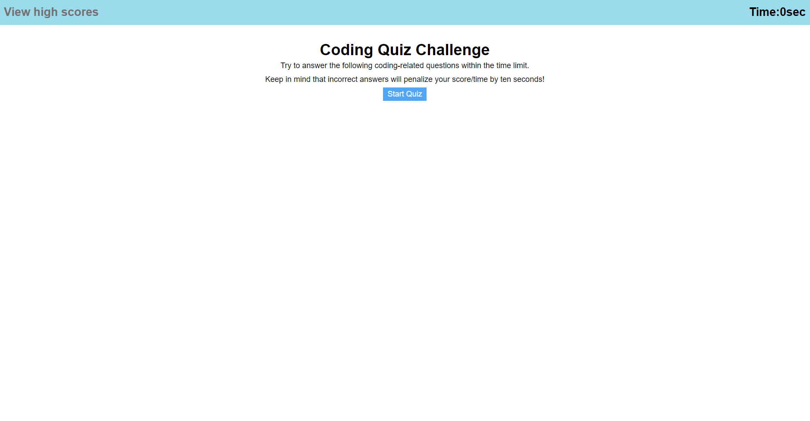
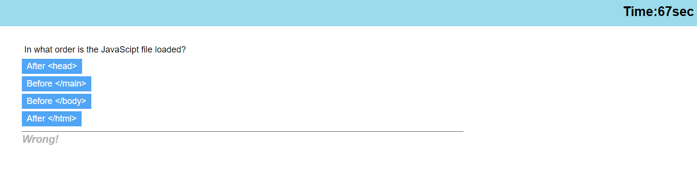
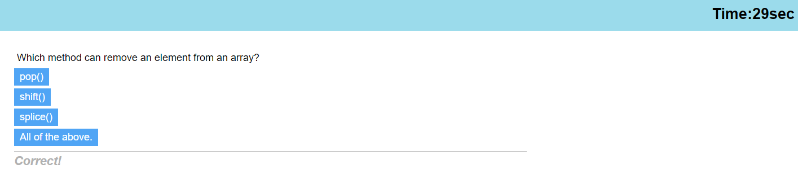
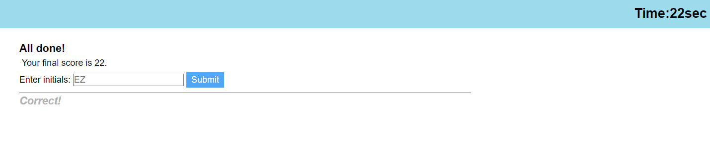
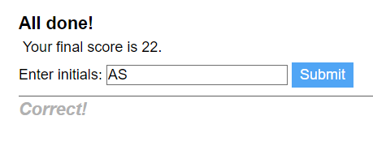
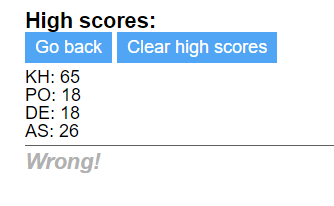

# Challenge-4

## Description
Challenge 4 coursework for UT bootcamp. This challenge is to make
a coding quiz that will give an indication of answering correct or wrong
with each question, and then give points based on how much time was left
when the quiz finished.

## Screenshots
---The main page---

---After clicking "Start"---

---Moving through the questions, timer subtracts 10 if a question is answered wrong---

---End of quiz page---

---Can enter initials (no more than 2)---

---Will get a pop-up if user enters with nothing---

---Stores multiple scores, all can be cleared---

## Usage
Simply click on the link and watch the magic happen. Link to the website: https://alliestewart.github.io/challenge-4/

## What I Have Learned
I've learned a lot about JavaScript functionality, and how useful
and adaptive it can be, in shaping what a webpage can look like
and do on the fly. I'm not the best at page displays though.

## Credits
Made by Allie Stewart.
Helpful resources from https://www.w3schools.com/js/, https://stackoverflow.com,
and class notes from module 3-4.

## Licenses
Please refer to the LICENSE in the repository.
